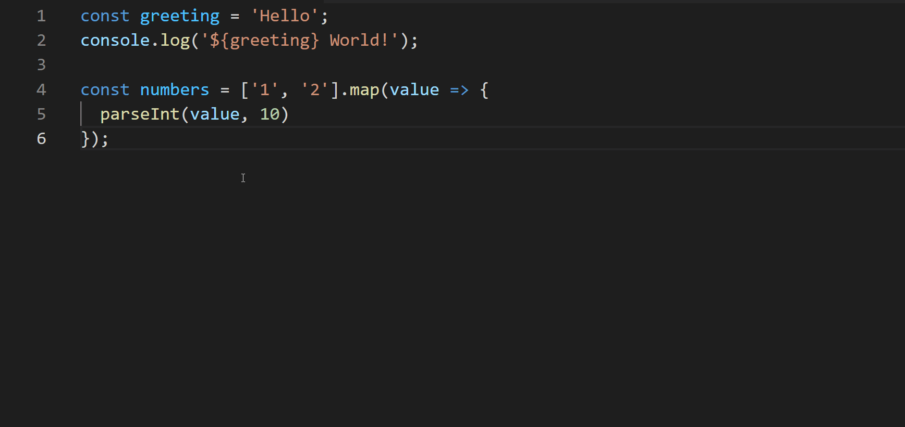
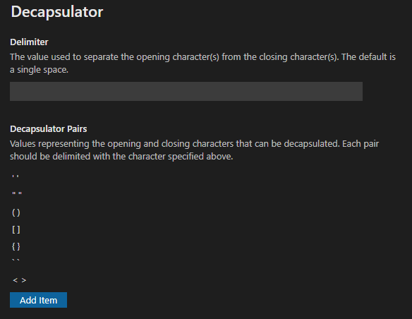

# Decapsulator

Decapsulator is an extension that allows you to quickly remove certain characters from the start and end of a string. This is meant to provide a quick way to remove characters like quotes or brackets that wrap the selection so you can encapsulate them in something else.

To prevent the unintentional removal of characters, the command will only execute if the selection starts and ends with a pair of strings specified in the settings.

The default shortcuts are as follows:

- Windows: `Ctrl+Shift+A`
- Mac: TBD (open to suggestions!)

## Demo

## Settings

The characters that can be removed by the application are limited to what's specified in the settings.

### Delimiter

The delimiter is the character separating the opening and closing string that can be removed from the user's selection. By default, this is a single space.

### Decapsulator Pairs

The list of pairs here represents the list of opening and closing characters that can removed from the selection.

With the settings as shown in the screenshot, here are some expected outputs based on the current selection:

- `"Hello World!"` would become `Hello World!`
- `|Hello World!|` would not change (the opening and closing pipe characters are not listed in the settings)
- `"Hello World!'` would not change (the opening double-quote and closing single-quote characters are not paired together in the settings)
